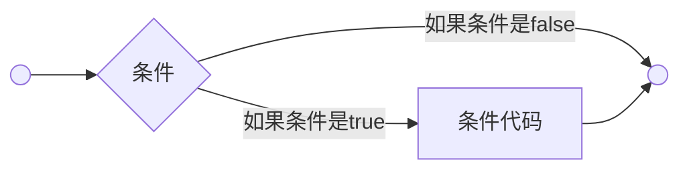
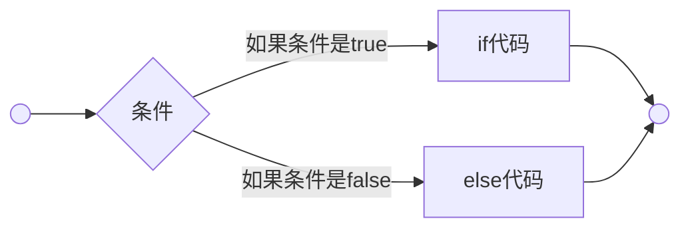

#C语言 

# 初识 C 语言

## HelloWorld 代码
````c
#include <stdio.h>
int main()
{
    printf("HelloWorld!");
    return 0;
}
````
 代码解释：
+ 以#开头的语句称为预处理器指令
+  `#include`语句不是必须的，但是如果一旦程序中有该语句，就必须将它放在程序的开始处
+ 以.h为后缀的文件我们称为头文件。可以是c标准库中的头文件，也可以是自定义的库文件
	+ `#include <file.h>`  会从系统标准目录中搜索要包含的头文件；
	+ `#include "file.h"`  会先在当前目录搜索，再从系统目录中搜索。
+ stdio.h文件中包含了有关输入输出的语句的函数
+ main()函数是c程序处理的起点/入口
+ main()函数可以返回一个值，也可以不返回值。如果某个函数没有返回值，那么在它前面就是关键字void
+ printf的作用是在屏幕上打印一行文字：“Hello World！”并换行（`\n`）
+ 最后的分号表示语句结束，注意不要使用中文分号
## 编码规范
注释的作用：
+ 有助于对代码的阅读
+  注释语言应准确、易懂、简洁
+ 单行注释：以`//`开头
+ 多行注释：以`/* `开头，`*/`结尾
## C语言的编译与执行
编译和执行过程：
1. 编译
形成目标代码/文件。目标代码是编译器的输出结果，常见扩展名为“.o”或“.obj”
2. 连接
将目标代码跟c函数库相连接，并将源程序所用的库代码与目标代码合并，形成最终可执行的二进制机器代码（可执行程序）
3. 执行
在特定的机器环境下运行c应用程序
# 变量

变量是计算机中一块特定的内存空间，由一个或多个连续的字节组成

## 变量的命名
通过变量名可以简单快速的找到在内存中存储的数据
## C语言变量命名规则
+  C语言规定变量名（标识符）只能由数字、字母、下划线3种字符组成，==首字母不能是数字或下划线==
+  不能使用关键字
# 数据类型
C语言中的类型

| 类型     | 描述                                                         |
| -------- | ------------------------------------------------------------ |
| 基本类型 | 算术类型，包括整数型和浮点型                                 | 
| 枚举类型 | 算术类型，被用来定义在程序中只能赋予其一定的离散整数值的变量 |
| void类型 | 类型说明符void表明没有可用的值                               |
| 派生类型 | 包括：指针类型、数组类型、结构类型、共用体类型、函数类型     |

## 基本类型
### 整数类型

| 类型           | 存储大小 | 值范围                                         |
| -------------- | -------- | ---------------------------------------------- |
| char           | 1字节    | -128到127或0到255                              |
| unsigned char  | 1字节    | 0到255                                         |
| signed char    | 1字节    | -128到127                                      |
| int            | 2或4字节 | -32,768到32,767或-2,147,483,648到2,147,483,647 |
| unsigned int   | 2或4字节 | 0到65,535或0到4,294,967,295                    |
| short          | 2字节    | -32,768到32,768                                |
| unsigned short | 2字节    | 0到65,535                                      |
| long           | 4字节    | -2,147,483,648到2,147,483,647                  |
| unsigned long  | 4字节    | 0到4,294,967,295                               |
==可以使用sizeof运算符，表达式sizeof(type)得到对象或类型的存储字节大小==
#### 字符型
使用`char`,使用单引号，里面只能放一个字符，如:`char a = 'f';`；使用双引号，其实是两个字符，占用两个字节，如：`char a = "f";`即`f`和`\0`
==注意：一个汉字占两个字节==
### 浮点类型
也叫实型

|类型|存储大小|值范围|精度|
|----|----|-----|---|
|float（单精度）|4字节|3.4E-38到3.4E+38|6位有效位|
|double（双精度）|8字节|1.7E-308到1.7E+308|15位有效位|
|long double|16字节|3.4E-4932到1.1E+4932|19位有效位|

==注意：==
==1. float 类型变量赋值时需要在数值的末尾加上一个 f==
==2. float 类型的占位符是%f==
==3. %.2f 可以控制数字的显示精度==
==4. 通常小数被存储为 double 类型==
==5. 数字后使用L时，数字成为 long double 类型，如：4.78L==
# 运算符
运算符：用算数运算符将运算对象（也称操作数）连接起来的、符号C语法规则的式子，称为C算术表达式，运算对象包括常量、变量、函数等
运算符分类：
1. 双目运算符：即参加运算的操作数有两个
2. 单目运算符：参加运算的操作数只有一个
3. 三目运算符：即参加运算的操作数有三个
## 算术运算符
`+、-、*、/、%、+=、-=、*=、/=、%=`
复合运算符：`a+=1`相当于`a=a+1`
## 关系运算符
`>、<、==、>=、<=、!=`
## 逻辑运算符
`&&`逻辑与，两个条件都为真，则结果为真
`||`逻辑或，两个条件至少有一个为真，则结果为真
`!`逻辑非
## 三目运算符
语法：`条件？条件为true的时候执行：条件为false的时候执行`
## 逗号运算符
逗号运算符的结果是`,`后边表达式的结果
## 自增自减运算符
+ `++`
	+ 进行自增运算
	+ 分为两种，==前置++==和==后置++==
	+ 前置`++`,会先把值自动+1，再返回
	+ 后置`++`,会先把值返回，再自动+1
+ `--`
	+ 进行自减运算
	+ 分为两种，==前置--==和==后置--==
	+ 前置`--`,会先把值自动-1，再返回
	+ 后置`--`,会先把值返回，再自动-1
## 运算符的优先级
+ 在表达式中按照优先级先后进行运算，优先级高的先于优先级低的先运算
+ 优先级一样的按结合性来运算

# scanf函数与printf函数
## scanf函数
概述：c函数库包含了多个输入函数，scanf是最通用的一个，可以读取不同格式的数据
调用格式为:      scanf("<格式化字符串>"，<地址表>);

``` c
int num;
printf("请输入数量：");
scanf("%d",&num);
```

==注意：==
==1. 格式字符串的用法与 printf 函数类似==
==2. 读取基本类型的值时，变量前要加 `&` 符号==

| 转换字符串 | 含义                     |
| ---------- | ------------------------ |
| %d         | 把输入解释成有符号整型   |
| %c         | 把输入解释成字符型       |
| %s         | 把输入解释成字符串       |
| %f         | 把输入解释成单精度浮点数 |
| %lf        | 把输入解释成双精度浮点数 |

==注意：scanf 函数的返回值是重点，必须理解。==
scanf () 函数返回值分为 3 种：
1. 返回正整数。表示正确输入参数的个数。
2. 返回整数 0。表示用户的输入不匹配，无法正确输入任何值。
3. 返回-1。表示输入流已经结束。在 Windows 下，用户按下 `CTRL+Z`（会看到一个^Z 字符）再按下回车（可能需要重复多次），就表示输入结束；Linux/Unix 下使用 `CTRL+D` 表示输入结束。

> 关于~的作用解析：
> 1、在 Windows 下，用户按下 CTRL+Z（会看到一个^Z 字符），会停止输入流，scanf 会返回-1
> 2、-1 的补码为 11111111 11111111 11111111 11111111  一共 4 个字节。
> 3、~是 C 语言中的按位取反，因此~（-1）结果为 00000000 00000000 00000000 00000000 刚好为整数 0 的补码。
> 4、因此当输入 Ctrl+Z 时，scanf 会返回-1，while (~-1) == while (0)，0 为假，退出 while 循环。
> 

例：
计算 a+b 的值，==要求能够不停的接收系统的测试输入==
代码：
```c
#include <stdio.h>
int main()
{ 
	int a=0, b=0;
	while (~scanf("%d %d", &a, &b))
	{
		printf("%d", a + b);
	}
	return 0;
}
```

## scanf_s 函数
多一个参数，更安全， scanf_s ("<格式化字符串>"，<地址表>，限制大小);
## printf 函数
printf 函数和转换字符

| 转换字符 | 输出                         | 示例                                                         |
| -------- | ---------------------------- | ------------------------------------------------------------ |
| %d or %i | 有符号十进制整数             | printf（“%d 心%i 意\n”，3，2）；                               |
| %c       | 单个字符                     | printf（“少林功夫好（y/n）~%c\n”,'y'）；                     |
| %s       | 字符串                       | printf（“爱我的人%s，我爱的人%s\n”，"呵呵呵呵"，“老美了”）； |
| %f       | 浮点数，默认精度到 6 位小数    | printf（“圆周率：%.2f/n”，3.1415926）；                      |
| % %      | 打印一个%号                  | printf（“手游占中国网络游戏海外发行细分市场的 65% %”）；      |
| %p       | 指针占位符，打印地址                   | printf ("%p", a);                                              |
| %x       | 以十六进制                   | printf ("%x", a);                                              |
| %e       | 以指数形式输出单、双精度实数 | printf ("%e", a);                                              |
| %u       | 无符号的十进制的整数         | sum=4294967295 printf ("%u", sum);                             |
| %o       | 以八进制输出                 | printf ("%o", a);                                              |
| %b         |以二进制输出                              |printf ("%b", a);                                                              |

>  %2d 代表打印的整数占两个字符

转义序列小结

| 转义序列 | 名称     | 描述                         |
| -------- | -------- | ---------------------------- |
| \a       | 蜂鸣警报 | 在一些系统中警报不起作用     |
| \b       | 退格     | 将光标回退一个               |
| \f       | 换页     | 将光标移动到下一页的开始处   |
| \n       | 换行     | 将光标移动到下一行的开始处   |
| \r       | 回车     | 将光标移到当前行的开始处     |
| \t       | 水平制表 | 将光标移到下一个水平制表位置 |
| \v       | 垂直制表 | 将光标移到下一个垂直制表位置 |
| \ '      | 单引号   | 打印单引号                   |
| \ "      | 双引号   | 打印双引号                   |
| \?       | 问号     | 打印问号                     |
| \ \      | 反斜线   | 打印反斜线                   |

# 判断
## if 语句
语法：
```c
if(条件)
{
    要执行的代码
    /*如果条件为真将执行语句*/
}
```

流程图：


## if... else 语句
语法：
```c
if(条件)
{
    条件为true的时候执行
       /* 如果条件为真将执行的语句 */
}
else
{
    条件为false的时候执行
    /* 如果布尔表达式为假将执行的语句 */
}
```

流程图：


## 嵌套 if 语句
语法：

```c
if( 条件 1)
{
    条件1为true的时候执行代码
    /* 当条件 1 为真时执行 */
   if(条件 2)
   {
      条件2为true的时候执行代码
      /* 当条件 2 为真时执行 */
   }
}
```

## switch 语句
语法：

```c
switch(要判断的变量){
    case 情况1 :
       情况1要执行的代码;
       break; /* 可选的 */
    case 情况2  :
       情况2要执行的代码;
       break; /* 可选的 */
  
    /* 您可以有任意数量的 case 语句 */
    default : /* 可选的 */
       上述情况都不满足时要执行的代码;
}
```

**switch** 语句必须遵循下面的规则：
- 在一个 switch 中可以有任意数量的 case 语句。每个 case 后跟一个要比较的值和一个冒号。
- 当被测试的变量等于 case 中的常量时，case 后跟的语句将被执行，直到遇到 **break** 语句为止。
- 当遇到 **break** 语句时，switch 终止，控制流将跳转到 switch 语句后的下一行。
- 不是每一个 case 都需要包含 **break**。如果 case 语句不包含 **break**，控制流将会 *继续* 后续的 case，直到遇到 break 为止。
- 一个 **switch** 语句可以有一个可选的 **default** case，出现在 switch 的结尾。default case 可用于在上面所有 case 都不为真时执行一个任务。default case 中的 **break** 语句不是必需的。

## 嵌套 switch 语句
语法：
```c
switch(要判断的情况1) {
   case 'A': 
      printf("这个 A 是外部 switch 的一部分" );
      switch(要判断的情况2) {
         case 'A':
            printf("这个 A 是内部 switch 的一部分" );
            break;
         case 'B': /* 内部 B case 代码 */
      }
      break;
   case 'B': /* 外部 B case 代码 */
}
```

# 循环

## 循环类型
### while 循环
语法：
```c
while(条件)
{
   满足条件就执行;
}
```

### for 循环
语法：
```c
for ( init初始化循环变量; 条件; increment控制循环变量 )
{  
  执行的语句;
}
```

下面是 for 循环的控制流：
1. **init** 会首先被执行，且只会执行一次。这一步允许您声明并初始化任何循环控制变量。您也可以不在这里写任何语句，只要有一个分号出现即可。
2. 接下来，会判断条件。如果为真，则执行循环主体。如果为假，则不执行循环主体，且控制流会跳转到紧接着 for 循环的下一条语句。
3. 在执行完 for 循环主体后，控制流会跳回上面的 **increment** 语句。该语句允许您更新循环控制变量。该语句可以留空，只要在条件后有一个分号出现即可。
4. 条件再次被判断。如果为真，则执行循环，这个过程会不断重复（循环主体，然后增加步值，再然后重新判断条件）。在条件变为假时，for 循环终止
### do... while 循环
   do... while 循环会确保至少执行一次循环
   语法：

   ```c
   do
   {
      要执行的代码;
   
   }while( 条件 );
   ```

   ## 循环控制

   ### break 语句

   语法：

   ```c
   break;
   ```

   ### continue 语句

   语法：

   ```c
   continue;
   ```

   # 函数
   
   ## 函数定义

+ 函数就是把任意一段代码放在一个==盒子==里面
+ 在我想要让这段代码执行的时候，直接执行这个==盒子==里面的代码就行

```c
//每个C语言必备的一个函数，这个{}就是“盒子”
int main()
{
	return 0;
}
/*
	int:返回值类型
	main:函数名-->标识符，就是一个名字，想起什么就可以起什么
	():描述参数
	return 0:函数返回值
*/
```

使用方法：

```C
函数返回值类型 函数名(形参)
{
	函数体;
	return 返回值;
}
```

==注意点：==
==1. 函数返回值类型必须和 return 后面的数据的类型一致==
==2. 函数中没有返回值，可以用 void 表示，但是 void 中可以使用 return 结束当前函数==
==3. 函数内部的变量外部无法访问==

## 函数参数

+ 传入参数时，使用 `()`，`（）` 的作用是用来放参数的
+ 参数分为两种：
	+ 形参：函数定义时的参数，函数名后边括号里的数据
	+ 实参：函数调用时传的参数
	
	> 给被调函数传数值，只能改变被调函数形参的值，不能改变主函数实参的值
	
	例：
	
	```c
	void fn(形参写在这里) {
		//这是代码
	}
	
	fn(实参写在这里)
	```

+ 传多个参数时，按顺序一一对应

## 函数返回值

+ `return` 返回的意思，其实就是给函数一个==返回值==和==终断函数==
+ 函数调用本身也是一个表达式，表达式就应该有一个值出现
+ `return` 关键字就是可以给函数执行完毕一个结果

```c
int fn(){
	//执行代码
	return 100
}

//此时，fn()这个表达式执行完毕之后就有结果出现了
```

+ 我们可以在函数内部使用 `return` 把任何内容当作这个函数运行后的结果
+ 当我们开始执行函数时，函数内部的代码就会从上到下的依次执行，必须要等到函数内的代码执行完毕，而 `return` 关键字就是可以在函数中间的位置停掉，让后面的代码不再继续执行

## 函数声明

+ 直接声明
	必须在前面声明一下
	```c
	void func(void)//必须在前面声明
	{
		func();
	}
	int main()
	{
		func();
	}
	void func(void)
	{
		printf("Hello World\n");
	}
	```
+ 间接声明
	将函数的声明放在头文件中，`.c` 程序包含头文件即可
	```c
	main.c
	#include"zhf.h"

	zhf.h
	extern void func(void);//extern，可以在一个文件中引用另一个文件中定义的变量或者函数
	```
	
## 内存
1. 内存：物理内存、虚拟内存
	+ 物理内存：实实在在存在的存储设备
	+ 虚拟内存：操作系统虚拟出来的内存
	+ 操作系统会在物理内存和虚拟内存之间做映射
	+ 在写应用程序时，看到的都是虚拟地址
2. 在运行程序的时候，操作系统会将虚拟内存进行分区
	+ 堆
		+ 在动态申请内存的时候，在堆里开辟内存
	+ 栈
		+ 主要存放局部变量
	+ 静态全局区
		+ 未初始化的静态全局区：静态变量（定义变量的时候，前面加 static 修饰），或全局变量，==没有初始化的==，存在此区
		+ 初始化的静态全局区：全局变量、静态变量，==赋过初值的==，存放在此区
	+ 代码区
		+ 存放程序代码
	+ 文字常量区
		+ 存放常量的
## 普通的全局变量
在函数外部定义的变量
```c
int number = 100;//number 就是一个全局变量
int main()
{
	return 0;
}
```
作用范围：
+ 普通全局变量的作用范围：程序的所有地方（其它文件需要使用 `extern`）
+ 用之前需要声明，声明方法 `extern int number;`
+ 声明的时候，不要赋值
生命周期：程序运行的整个过程，一直存在，直到程序结束
==注意：定义普通的全局变量的时候，如果不赋初值，它的默认值为 0==
## 静态全局变量
```c
//定义全局变量的时候，前面用static修饰
static int number = 100；//number 就是一个静态全局变量
int main()
{
	return 0;
}
```
作用范围：只能在它定义的 `.c(源文件)` 中有效
生命周期：在程序的整个运行过程中，一直存在
==注意：定义静态全局变量的时候，如果不赋初值，它的默认值为 0==
## 普通的局部变量
在函数内部定义，或者复合语句中定义的变量
```c
int main()
{
	int num;//普通局部变量
	if(1)
	{
		int a;//普通局部变量
	}
}
```
作用范围：
+ 在函数中定义的变量，在它的函数中有效
+ 在复合语句中定义的，在它的复合语句中有效
## 静态局部变量
定义局部变量的时候，前面加==static==修饰
作用范围：在它定义的函数或复合语句中有效
生命周期：第一次调用函数的时候，开辟空间赋值，函数结束后，==不释放==，以后再调用函数的时候，就不能再为其开辟空间，也不赋初值，用到是以前的那个变量
## 静态函数 (内部函数)
在定义函数的时候，返回值类型前面加==static==修饰，这样的函数称为==静态函数==
static 限定了函数的作用范围，在定义的 `.c` 中有效

# 数组

## 一维数组
### 创建一维数组
```c
//类型 数组名[数组长度]
int iArray[8];
double dArray[10];
```

1. 数组长度不代表下标，数组中的最大下标是数组长度-1
2. 数组长度必须是常量，不能是变量
3. ==内存连续==，变量的变量名是有规律的
### 初始化一维数组
+ 默认初始化
```c
//完整的初始化
int array[3]={1,2,3};
//完整初始化时，数组长度可以省略
int array[]={1,2,3};
//不完整初始化时，默认值
int array3[3]={1};//第一个为1，其他为0
//字符串
char str[]="LOVE";//数组长度：5，字符串结束标记'\0'
//"  " 一定有字符串边界符
char str2[]={'A','B','C'};//字符数组
```
+ 手动初始化和手动打印
	+ 数组的使用方式：`数组名[数组下标]; //数组下标从0开始`
	+ 使用循环

## 数组的分类
+ 字符数组：`char s[10];`
+ 短整型的数组：`short a[10];`
+ 整型数组：`int a[10];`
+ 长整型数组：`long a[5];`
+ 浮点型数组：`float a[6];`（单精度）`double a[8];`（双精度）
+ 指针数组：`char *a[10];`
+ 结构体数组：`struct student a[10];`
## 二维数组
语法：`数组名 [行下标][列下标]`
# 取地址运算
使用 `&` 来获取地址
# 指针
## 指针的概念
系统给虚拟内存的每个存储单元分配了一个编号，从 `0x00 00 00 00 ~ 0xff ff ff ff` 这个编号称为地址，==指针就是地址==

指针变量：是个变量，是个指针变量，即这个变量用来==存放一个地址编号==
## 指针变量的定义
+ 简单的指针变量
`数据类型 * 指针变量名；`

```c
int *p;//定义了一个指针变量p
```

在定义指针变量的时候 `*` 是用来修饰变量的，说明变量 p 是个指针变量 

+ 关于指针的运算符
`&` 取地址、`*` 取值
```c
int a = 0x1234abcd;
int *p;//在定义指针变量的时候*代表修饰的意思，修饰p是个指针变量
p=&a;//把a的地址给p赋值，&是取地址符
```


## 指针的用处
交换两数的值
```c
#include <stdio.h>
void swap(int* x, int* y)
{
	int temp;
	temp = *x;
	*x = *y;
	*y = temp;
}
int main()
{
	int a = 10, b = 20;
	swap(&a, &b);
	printf("%d %d", a, b);
}
```
## 指针与数组

```c
int a[5];
int *p;
p = &a[0];
//指针变量p保存了数组a中第0个元素的地址，即a[0]的地址
```
==数组名代表数组的首地址==
通过指针变量运算加取值的方法来引用数组的元素
## 指针的分类
按指针指向的数据的类型来分
1. 字符指针
字符型数据的地址
```c
char *p;//定义了一个字符指针变量，只能存放字符型数据的地址编号
```
2. 短整型指针
```c
short *p;//定义了一个短整型的指针变量p，只能存放短整型变量的地址
```
3. 整型指针
```c
int *p;//定义了一个整型的指针变量p，只能存放长整型变量的地址
```
4. 长整型指针
```c
long *p;//定义了一个长整型的指针变量p，只能存放长整型变量的地址
```
5. float 型的指针
```c
float *p；//定义了一个float型的指针变量p，只能存放float型变量的地址
```
6. double 型的指针
```c
double *p;//定义了一个double型的指针变量p，只能存放double型变量的地址
```
7. 函数指针
8. 结构体指针
9. 指针的指针
10. 数组指针
11. 通用指针 `void *p;`

> 无论什么类型的指针变量，在 32 位系统下，都是 4 个字节；在 64 位系统下，都是 8 个字节。
> 指针只能存放对应类型的变量的地址编号
## 指针与字符串

### 字符串的概念
字符串就是以 `\0` 结尾的若干的字符的集合：比如"helloworld"。
字符串的地址，是第一个字符的地址。
如：字符串“helloworld”的地址，其实是字符串中字符’h’的地址。我们可以定义一个字符指针变量保存字符串的地址, 比如：`char *s="helloworld";`
### 字符串的存储形式
数组、文字常量区、堆
1. 字符串存放在数组中
其实就是在内存（栈、静态全局区）中开辟了一段空间存放字符串。
例：`char string[100]="I love C!"` 定义了一个字符数组 string, 用来存放多个字符，并且用"I love C!"给 string 数组初始化，字符串"I love C!"存放 string 中。
==注意：普通全局数组，内存分配在静态全局区；普通局部数组，内存分配在栈区；静态数组（静态全局数组、静态局部数组），内存分配在静态全局区==
2. 字符串存放在文字常量区
在文字常量区开辟了一段空间存放字符串，将字符串的首地址赋给指针变量。
例：`char *str="I love C!"` 定义了一个指针变量 str，只能存放字符地址编号，I love C！这个字符串中的字符不能存放在 str 指针变量中。str 只是存放了字符 I 的地址编号，"I love C！"存放在文字常量区
3. 字符串存放在堆区
使用 malloc 等函数在堆区申请空间，将字符串拷贝到堆区。
例：
```c
char *str=(char*)malloc(10);//动态申请了10个字节的存储空间，首地址给str赋值
strcpy(str,"I love C");//将字符串“I love C!”拷贝到str指向的内存里
```
### 字符串的可修改性
字符串内容是否可以修改，取决于字符串存放在哪里
1. 存放在数组中的字符串的内容是可修改的
```c
char str[100]="I love C!";
str[0]='y';//正确可以修改的
```
==注意：数组没有用 const 修饰==
2.  文字常量区里的内容是不可修改的
```c
char *str="I love C!";
*str='y';//错误，I存放在文字常量区，不可修改
```
==注意：str 指向文字常量区的时候，它指向的内存的内容不可被修改。str 是指针变量可以指向别的地方，即可以给 str 重新赋值，让它指向别的地方。==
3. 堆区的内容是可以修改的
```c
char *str=(char*)malloc(10);
strcpy(str,"I love C");
*str=’y’;//正确，可以，因为堆区内容是可修改的
```
==注意：str 指向堆区的时候，str 指向的内存内容是可以被修改的。str 是指针变量，也可以指向别的地方。即可以给 str 重新赋值，让它指向别的地方==

> 小结：str 指针指向的内存能不能被修改，要看 str 指向哪里。str 指向文字常量区的时候，内存里的内容不可修改 str 指向数组（非 const 修饰）、堆区的时候，它指向内存的内容是可以修改

## 指针数组
指针数组==本身是个数组==，是个指针数组，是若干个相同类型的指针变量构成的集合
```c
#include <stdio.h>
int main()
{
	char* str1 = "xiaohong";
	char* str2 = "xiaohuang";
	char* str3 = "xiaohei";
	char* name[3] = { str1,str2,str3 };
	int i;
	for (i = 0; i < 3; i++)
	{
		printf("%s\n", name[i]);
		printf("%p\n", name[i]);
	}
	return 0;
}
```
输出结果：
```c
xiaohong
00007FF77D109CA8
xiaohuang
00007FF77D109CB8
xiaohei
00007FF77D109CC8
```
## 指针的指针
指针的指针，即指针的地址
```c
int a=0x12345678;
//假设：a的地址是0x00002000
int *p;
p =&a;
//则p中存放的是a的地址编号，即0x00002000

//假如指针p的地址编号是0x00003000,这个地址编号就是指针的地址
int **p;
q=&p;//q保存了p的地址，也可以说q指向了p
则q里存放的就是0x00003000

```
## 数组指针
本身==是个指针==，指向一个数组，加 1 跳一个数组，即指向下一个数组
用法：`指向的数组的类型 (*指针变量名) [指向的数组的元素个数]`
```c
int (*p) [5];
//定义了一个数组指针变量p，p指向的是整型的有5个元素的数组p+1往下指5个整型，跳过一个有5个整型元素的数组
```
==一般用于二维数组==
假设数组 a 中第 0 个元素的地址为 1000，那么每个一维数组的首地址如图


| 表示形式         | 含义                                     |
| ---------------- | ---------------------------------------- |
| `a`                | 二维数组名，指向一维数组 `a[0]`, 即 0 行首地址 |
| `a[0]，*a(a+0),*a ` | 0 行 0 列元素地址                           |
| `a+1,&a[1]`        | 1 行首地址                                |
| `a[1],*(a+1) `     | 1 行 0 列元素 `a[1][0]` 的地址                  |
| `a[1]+2,*(a+1)+2,&a[1][2]`  | 1 行 2 列元素 `a[1][2]` 的地址                  |
| `*(a[1]+2),*(*(a+1)+2),a[1][2] `                | 1 行 2 列元素 `a[1][2]` 的值                                         |

## 数组名取地址
```c
#include <stdio.h>
int main()
{
	int a[10];
	printf("a=%p\n",a);
	printf("a+1=%p\n",a+1);
	printf("&a=%p",&a);
	printf("&a+1=%p",&a+1);
}
```
`a` 和 `&a` 所代表的地址编号是一样的，即他们指向同一个存储单元，但是 `a` 和 `&a` 的指针类型不同。
`a` 是个 `int *` 类型的指针，是 `a[0]` 的地址，`&a` 变成了数组指针，加 1 跳一个 10 个元素的整型一维数组
## 数组名和指针变量的异同
```c
int a[5]={1,2,3,4,5};
int *p;
p=a;
```
**相同点**：a 是数组的名字，是 a[0]的地址，p=a 即 p 保存了 a[0]的地址，即 a 和 p 都指向 a[0], 所以在引用数组元素的时候，a 和 p 等价引用数组元素
**不同点**：
1. a 是常量，p 是变量
2. 对 a 取地址和对 p 取地址结果不同，因为 a 是数组的名字，所以对 a 取地址结果为数组指针；p 是个指针变量，所以对 p 取地址（&p）结果为指针的指针
## 指针和函数的关系
### 给函数传指针参数
要想改变主调函数中变量的值，必须传变量的地址，而且还得通过 `*+地址` 去赋值。无论这个变量是什么类型的
```c
#include <stdio.h>
void func(int *a){
    *a = 200;
}
int main()
{
    int x = 100;
    int *p = &x;
    func(p);
    printf("%d\n", x);
}
```
给函数传数组：给函数传数组的时候，没法一下将数组的内容作为整体传进去。只能传数组名进去，数组名就是数组的首地址，即只能把数组的地址传进去。也就是说，只能传一个 4 个字节大小的地址编号进去。
例：传一维数组的地址
```c
#include <stdio.h>
// void fun(int p[])//形式 1
void fun(int *p) //形式 2
{
    printf("%d\n", p[2]);
    printf("%d\n", *(p + 3));
}
int main()
{
    int a[10] = {1, 2, 3, 4, 5, 6, 7, 8};
    fun(a);
    return 0;
}
```
例：传二维数组的地址
```c
#include <stdio.h>
// void fun( int p[][4] )//形式 1
void fun(int (*p)[4]) //形式 2
{
    printf("%d", p[1][2]);
}
int main()
{
    int a[3][4] = {{1, 2, 3, 4}, {5, 6, 7, 8}, {9, 10, 11, 12}};
    fun(a);
    return 0;
}
```
例：传指针数组
```c
#include <stdio.h>
void fun(char **q) // char *q[]
{
    int i;
    for (i = 0; i < 3; i++)
        printf("%s\n", q[i]);
}
int main()
{
    char *p[3] = {"hello", "world", "kitty"}; // p[0] p[1] p[2] char *
    fun(p);
    return 0;
}
```
### 函数返回值是指针
例：
```c
#include <stdio.h>
#include <string.h>
char *strLong(char *str1, char *str2){
    if(strlen(str1) >= strlen(str2)){
        return str1;
    }else{
        return str2;
    }
}
int main(){
    char str1[30], str2[30], *str;
    gets(str1);
    gets(str2);
    str = strLong(str1, str2);
    printf("Longer string: %s\n", str);
    return 0;
}
```
==注意：返回地址的时候，地址指向的内存的内容不能释放如果返回的指针指向的内容已经被释放了，返回这个地址，也没有意义了==

## 函数指针
在运行程序的时候，会将函数的指令加载到内存的代码段。所以函数也有起始地址。
C 语言规定：函数的名字就是函数的首地址，即函数的入口地址，可以定义一个指针变量，来存放函数的地址，这个指针变量就是函数指针变量。
### 函数指针的定义和调用
定义：
```c
int max(int x, int y)
{
    ...
}
int (*p)(int, int); //定义了一个函数指针变量p，p指向的函数
p = max;
```
调用：
```c
(*p)(30,50);
p(30,50);
```
例：
```c
#include <stdio.h>
int max(int a,int b)
{
    if(a>b)
        return a;
        else
            return b;
}
int main()
{
    int (*p)(int, int) = max;
    printf("%d", p(10, 20));
}
```
### 函数指针数组
==是一个数组==，里面有相同类型的函数指针
例：
```c
#include <stdio.h>
int max(int a,int b)
{
    if(a>b)
        return a;
        else
            return b;
}
  
int min(int a,int b)
{
    if(a<b)
        return a;
        else
            return b;
}
  
int add(int a,int b)
{
    return a + b;
}
  
int main()
{
    int (*p[])(int, int) = {add,min,max};
    int res1 = (*p)(1, 2);
    printf("%d\n", res1);
    int res2 = (*p[1])(1, 2);
    printf("%d\n", res2);
    int res3 = (*(p+2))(1, 2);
    printf("%d\n", res3);
}
```
### 函数指针的用处
 函数指针用来保存函数的入口地址。
## 易混淆的指针
1. `int *a[5];`
这是个指针数组，数组 a 中有 5 个整型的指针变量
a[0]~a[4]，每个元素都是 `int*` 类型的指针变量
2. `int (*a) [5];`
数组指针变量，它是个指针变量。它占 8 个字节，存地址编号。
它指向一个数组，它加 1 的话，指向下一行
3. `int**p;`
这个是个指针的指针，保存指针变量的地址
它经常用在保存指针的地址
4. `int*f(void);`
==注意：`*f` 没有用括号括起来==
它是个函数的声明，声明的这个函数返回值为 `int*` 类型的
5. `int(*f)(void);`
==注意：`*f` 用括号括起来了，修饰 f 说明 f 是个指针变量==
f 是个函数指针变量，存放函数的地址，它指向的函数必须有一个 int 类型的返回值，没有参数
## 特殊指针
1. 空类型的指针（`void*`）
`void*` 通用指针，任何类型的地址都可以给 `void*` 类型的指针变量赋值
因为对于这种通用型接口，你不知道用户的数据类型是什么，但是你必须能够处理用户的各种类型数据，因而会使用 `void*` 类型。`void*` 能包容地接受各种类型的指针。也就是说，如果你期望接口能够接受任何类型的参数，你可以使用 `void*` 类型。但是在具体使用的时候，你必须转换为具体的指针类型。
2. 空指针 NULL
```c
char *p=NULL;
```
p 哪里都不指向，也可以认为 p 指向内存编号为 0 的存储单位
# 动态内存申请
## 初识动态内存
C 语言提供了一些内存管理函数，这些内存管理函数可以按需要动态的分配内存空间，也可把不再使用的空间回收再次利用
### 静态分配
1. 在程序编译或运行过程中，按事先规定大小分配内存空间的分配方式，如 `int a[10]`
2. 必须事先知道所需空间的大小
3. 分配在栈区或全局变量区，一般以数组的形式
4. 按计划分配
### 动态分配
1. 在程序运行过程中，根据需要大小自由分配所需空间
2. 按需分配
3. 分配在堆区，一般使用特定的函数进行分配
## malloc 函数
`void * malloc(int size)`
size：对象占据的内存字节数
头文件：stdlib. h
在内存的动态存储区（堆区）中分配一块长度为 size 字节的连续区域，用来存放类型说明符指定的类型。函数原型返回 `void*` 指针，使用时必须做相应的强制类型转换
返回值：
+ 分配空间的起始地址（分配成功）
+ NULL（分配失败）
注意：
+ 在调用 malloc 之后，一定要判断一下，是否申请内存成功
+ 如果多次 malloc 申请的内存，第一次和第二次申请的内存不一定是连续的
例：
```c
#include <stdio.h>
#include <stdlib.h>
int main()
{
    printf("请输入班级的人数:\n");
    int number = 0;
    scanf("%d", &number);
    int *p = (int *)malloc(sizeof(int) * number);
    for (int i = 0; i < number; i++)
    {
        scanf("%d", &p[i]);
    }
    for (int i = 0; i < number; i++)
    {
        printf("第%d个学生的成绩：%d\n", i + 1, p[i]);
    }
    //数据==>数据库
    free(p);
    return 0;
}
```
## free 函数
释放内存函数
free 函数释放 p 指向的内存
```c
char *p=(char *)malloc(100);
free(p);
```
## calloc 函数
`void * calloc(int num,int size)`
num：对象个数，size：对象占据的内存字节数
头文件：stdlib. h
在内存的堆中，申请 n 块，每块的大小为 size 个字节的连续区域
函数的返回值：
+ 返回申请的内存的首地址（申请成功）
+ 返回 NULL（申请失败）
==注意：malloc 和 calloc 函数都是用来申请内存的==
区别：
+ 函数的名字不一样
+ 参数的个数不一样
+ malloc 申请的内存，内存中存放的内容是随机的，不确定的，而 calloc 函数申请的内存中的内容为 0
例：
```c
#include <stdio.h>
#include <stdlib.h>
int main()
{
    printf("请输入班级的人数:\n");
    int number = 0;
    scanf("%d", &number);
    int *p = (int *)calloc(number,sizeof(int));
    for (int i = 0; i < number; i++)
    {
        scanf("%d", &p[i]);
    }
    for (int i = 0; i < number; i++)
    {
        printf("第%d个学生的成绩：%d\n", i + 1, p[i]);
    }
    return 0;
}
```
例：
```c
#include <stdio.h>
#include <stdlib.h>
#define TOTAL 100
int main()
{
    printf("请输入班级的人数:\n");
    int number = 0;
    scanf("%d", &number);
    char (*p)[TOTAL] = (char(*)[TOTAL])calloc(number, TOTAL);
    for (int i = 0; i < number; i++)
    {
        scanf("%s", *(p + i));
    }
    for (int i = 0; i < number; i++)
    {
        printf("第%d个学生的姓名：%s\n", i + 1, p[i]);
    }
    return 0;
}
```
## realloc 函数
`void* realloc(void* memblock, size_t size)`
头文件：stdlib. h

realloc 函数返回的是 `void*` 类型的指针，指向在堆区重新开辟的内存块的起始地址，memblock 是先前开辟的内存块的指针（也就是 malloc 或 calloc 之前申请的那块内存空间，即需要调整大小的内存空间），size_t size 指的是 New size in bytes, 新的字节数，注意不是增加的字节数，而是新开辟的那块内存空间的字节数，返回值为调整之后的内存的起始地址。

作用：在原先 s 指向的内存基础上重新申请内存，新的内存的大小为 new_size 个字节，如果原先内存后面有足够大的空间，就追加，如果后边的内存不够用，则 realloc 函数会在堆区找一个 newsize 个字节大小的内存申请，将原先内存中的内容拷贝过来，然后释放原先的内存，最后返回新内存的地址
## 内存泄露
申请的内存，首地址丢了，找不到了，再也没法使用了，也没法释放了，这块内存就被泄露了
例：
```c
int main()
{
	char *p;
	p=(char*)malloc(100);
	//接下来，可以用p指向的内存了
	p="xiaohong";//p指向别的地方了
	//从此以后，再也找不到你申请的100个字节。则动态申请的100个字节就被泄露了	
}
```

# 字符串
## 定义
+ 一个或多个字符的序列称为字符串
+ C 语言中形如=="My heart will go on."==
+ 双引号不是字符串的一部分，仅用来告知编译器括起来的是字符串
### C 语言中的字符串
在 C 语言中，字符串实际上是使用空字符 `\0` 结尾的一维字符数组。因此，`\0` 是用于标记字符串的结束。

**空字符（Null character**）又称结束符，缩写 NUL，是一个数值为 0 的控制字符，`\0` 是转义字符，意思是告诉编译器，这不是字符 0，而是空字符。
## 字符串与字符数组

区别：最后一位是否为空字符

### 定义字符串
下面的声明和初始化创建了一个 **LOVE** 字符串。由于在数组的末尾存储了空字符 `\0`，所以字符数组的大小比单词 **LOVE** 的字符数多一个。
```c
char a[5] = {'L', 'O', 'V', 'E',  '\0'};
char a[] = { 'L', 'O', 'V', 'E',  '\0' };
char a[] = "LOVE";
```

### 输入字符串

因为 a[]本身就是一个地址，所以使用 scanf 时不需要 `&`

```c
scanf("%s",a);
```

### 打印字符串

```c
printf("%s",a);
//打印单个字符时
printf("%c",a[i]);
```

==其中%c 格式对应的是单个字符，%s 格式对应的是字符串==
%s 工作方式：从当前首地址打印到 `\0`

## 字符串处理函数
### gets函数
头文件： stdio. h 

与 scanf ("%s", s) 相似，但不完全相同，使用 scanf ("%s", s) 函数输入字符串时存在一个问题，就是如果输入了空格会认为字符串结束，空格后的字符将作为下一个输入项处理，但 gets () 函数将接收输入的整个字符串直到遇到换行为止，不对接受字符串的 buffer 进行边界检测，会造成越界，从而产生 bug

```c
gets(a);
推荐使用fgets();
fgets(a, 10, stdin);//从标准输入流中读取10字节到数组a中
注意：fgets会默认给最后一个元素设置为\n
puts(a);
```
封装 fgets，用来接收字符串的字符数组，接收的字符总数
```c
void GetString(char str[],int count)
{
	//使用fgets函数接收字符串，使用\0替换字符数组的最后一位\n
	fgets(str,count,stdin);
	//返回\n字符所在的指针，使用strchr()函数
	char* find = strchr(str,'\n');
	if(find)//如果找到了
		*find = '\0';
}
```

### puts 函数
头文件： stdio. h 

puts ()： puts 和 printf 的用法一样, puts () 函数的作用与语句 printf ("%s\n", s); 的作用相同。注意：puts 在输出字符串后会自动输出一个回车符

### strlen 函数
头文件：string. h

strlen ()：使用格式 `strlen (s)`
返回 s 的长度，不包括结束符`\0`

### strcpy_s 函数
头文件：string. h

strcpy_s (): 使用格式 `strcpy (p，size, s)`
将 s 里的字符串赋值给 p 里面, size 表示字符串大小

### strncpy_s 函数
头文件：string. h

strncpy_s ()：使用格式 `strncpy (p, size, s, n)`
将 s 字符串的前 n 个字节赋值到 p 里面，size 表示字符串大小

### strcat_s 函数
头文件：string. h

strcat_s ()：使用格式 `strcat_s (p, size, s)`
将 s 字符串追加到 p 后面，会追加 `\0`，size表示追加后字符串的大小

### strncat_s 函数
头文件：string. h

strncat_s ()：使用格式 `strcat_s (p, size, s)`

将 s 字符串里的前 n 个字节追加到 p 后面，会追加 `\0`，size 表示追加后字符串的大小

### strcmp 函数
头文件：string. h

strcmp ()：使用格式 `strcmp (p, s)`

比较 p 和 s 字符串的大小，比较的方法：逐个字符去比较 ASCII 码，一旦比较出大小返回。如果所有字符都一样，则返回 0

### strchr 函数
头文件：string. h

strchr ()：使用格式 `strchr (s, c)`

字符匹配函数，在字符指针 s 指向的字符串中，找 ASCII 码为 c 的字符，注意：是首次匹配，如果说 s 指向的字符串中有多个 ASCII 为 c 的字符，则找的是第一个字符

### strstr 函数
头文件：string. h

strstr ()：使用格式 `strstr (str1，str2)`

字符串匹配函数，在 str1 指向的字符串中查找 str2 指向的字符串，也是首次匹配

### 字符串转数值
头文件：stdlib. h

atoi/atol/atof 字符串转换功能
函数的声明：`int atoi (const char*nptr)；`
例：
```c
int num；
num=atoi("12岁")；
//则num的值为12
```
### strtok_s 函数
头文件：string. h

strtok_s ()：使用格式 `strtok（str，"需要切割的标识符"，缓冲用的指针）`

字符串切割函数，str 是需要切割的字符串
例：
```c
char str[100]="山东|济宁|曲阜"
char* buf=NULL；
strtok(str,"|",&buf);
```
可以将其封装成 split () 函数：
```c
void split(char *str, char **splitStr, char *p)
{
    char *buf = NULL;
    splitStr[0] = strtok_s(str, p, &buf);
    int i = 0;
    while (splitStr[i])
    {
        i++;
        splitStr[i] = strtok_s(NULL, p, &buf);
    }
}

//调用
split(a, b, c);
//a是要分割的字符串的地址，b是存放分割完字符串指针数组的地址，c是分隔符的地址
```

实例：
```c
#include <stdio.h>
#include <string.h>
#include <stdlib.h>
void split(char *str, char **splitStr, char *p)
{
    char *buf = NULL;
    splitStr[0] = strtok_s(str, p, &buf);
    int i = 0;
    while (splitStr[i])
    {
        i++;
        splitStr[i] = strtok_s(NULL, p, &buf);
    }
}
int main()
{
    char a[100] = "山东%济宁%曲阜";
    char *b[100];//指针数组
    char c[100] = "%";
    split(a, b, c);
    int m = 0;
    while (b[m])
    {
        printf("%s\n", b[m]);
        m++;
    }
}
```
输出结果：
```c
山东
济宁
曲阜
```
### memset 函数
头文件：string. h

memset ()：使用格式 `void* memset（void* ptr, int value, size_t num）;`

空间设定函数，memset 函数是将 ptr 指向的内存空间的 num 个字节全部赋值为 value
### sprintf_s 函数
头文件：stdio. h

sprintf_s ()：使用格式 `sprintf_s(str,size,"我%s你","s");`

将数据格式化输出到字符串, str 是输出的字符串，size 用来限制长度，%s 是接收要拼接的字符，s 是拼接的字符
例：
```c
#include <stdio.h>
int main()
{
    char str[100];
    sprintf_s(str, 100, "我%s你", "爱");
    printf("%s\n", str);
}
```
输出：
```c
我爱你
```
例：
```c
#include <stdio.h>
int main()
{
    char time[100];
    sprintf_s(time, 100, "%d年%d月%d日", 2022, 9, 30);
    printf("%s\n", time);
}
```
输出：
```c
2022年9月30日
```
### sscanf_s 函数
头文件：stdio. h

读取格式化的字符串中的数据
例：
```c
#include <stdio.h>
int main()
{
    char *address = "山东 济宁 曲阜";
    char str[3][100];
    sscanf_s(address, "%s %s %s", str[0], 100, str[1], 100, str[2], 100);
    for (int i = 0; i < 3; i++)
    {
        printf("%s\n", str[i]);
    }
}
```
输出：
```c
山东
济宁
曲阜
```
如需跳过数据，可以使用 `%*s`
如需指定宽度，可以使用 `%xs`，其中 `x` 表示大小，如：`%8s`
集合操作：使用正则表达式匹配 `%[a-z]` `%[abc]` `%[^abc]`
# 结构体
