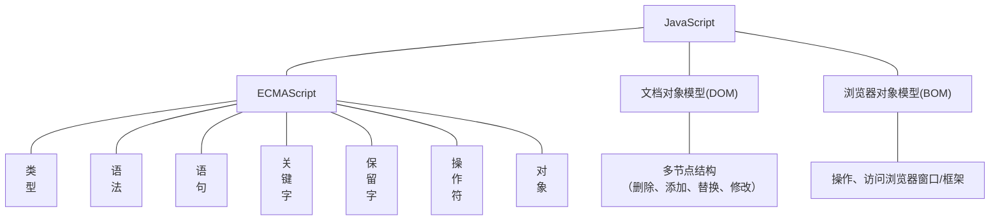

#前端 #JavaScript

参考教程：[JavaScript 教程](https://www.w3school.com.cn/js/index.asp)

重点：
+ js 教程：一直到 jsloop while
+ js 对象：对象定义、对象属性、对象方法
+ js 函数：函数定义、函数参数、函数调用
+ js DOM：全部
+ js BOM：js window
----
# 什么是 JavaScript
JavaScript 是属于 HTML 和 Web 的编程语言。

JavaScript 是 web 开发者必学的三种语言之一：

- [[HTML|HTML]] 定义网页的内容
- [[CSS|CSS]] 规定网页的布局
- JavaScript 对网页行为进行编程



# 运行环境
1. 浏览器
2. Node：一个包含谷歌浏览器 V8 引擎的 C++程序

# 编辑器
可以使用 [[VSCode]], 同时下载 [[Node JS]]
# JavaScript 代码的书写位置
三种书写方式：==行内式（不推荐）、内嵌式、外链式==

+ 行内式（不推荐）
```html
    <!--写在a标签的href属性上-->

    <a  href="javascript:alert('Hello World')">点我</a>

    <!--写在其它元素上-->

    <dir onclick="alert('Hello World')">点我</dir>
```
+ 内嵌式
```html
    <!--在html页面书写一个script标签，标签内部书写js代码-->

    <script>

        alert("Hello World");

    </script>

    <!--注：script标签可以防止head里面也可以放在body（推荐放在最后）里面-->
```
+ 外链式（推荐）
在外部建一个 `.js` 文件，在文件内书写 js 代码，把写好的文件引入 html 页面
```js
alert("hello world")
```
这是 html，可以添加多个 js 文件
```html
    <!--通过script标签的src属性，把写好的js文件引入页面-->

    <script src="js/hello.js"></script>
```
# 注释与规范
1. 注释
+ 单行
使用 `//`
快捷键：`ctrl` + `/` 添加或取消注释
+ 多行
使用 `/**/`
快捷键：`alt` + `shift` + `a` 添加或取消注释
2. 规范
每行末尾可以不使用分号，但是如果一行有多个代码时，必须使用分号隔开
# 变量
## 什么是变量
+ 变量指的是在程序中保存数据的一个容器
+ 变量是计算机内存中存储数据的标识符，根据变量名称可以获取到内存中存储的数据
+ 我们向内存中存储了一个数据，然后要给这个数据起一个名字，为了使我们以后再次找到它
+ 语法：`var 变量名 = 值`
例：定义变量及赋值
```js
//定义一个变量
var num

//给一个变量赋值
num = 100；

//定义一个变量的同时给其赋值
var num2 =200；
```
+ ==注意：==
1. 一个变量名只能存储一个值
2. 当再次给一个变量赋值的时候，前面一次的值就没有了
3. 变量名称区分大小写（`js` 严格区分大小写）
## 变量的命名规则和命名规范
+ 规则：必须遵守，否则报错
	+ 一个变量名称可以由==数字、字母、下划线、美元符号（$）组成==
	+ 严格区分大小写
	+ 不能由数字开头
	+ 不能是==保留字==或者==关键字==
	+ 不要出现空格
+ 规范：建议遵守的，不遵守不会报错
	+ 变量名尽量有意义（语义化）
	+ 遵循驼峰命名规则，由多个单词组成的时候，从第二个单词开始首字母大写
	+ 不要使用中文
# 数据类型
数据类型：是指我们存储在内存中的数据的类型，通常分为两大类**基本数据类型**和**复杂数据类型**
+ 基本数据类型
	+ Number，包括整数、浮点数、科学计数法、十进制、十六进制、二进制、八进制、NaN, 如 `var a = 10`
	+ String，字符串类型，使用双引号或单引号，如 `var a = "Hello"`
	+ Boolean，布尔类型，结果为 true 或 false，如 `var isCheck = true`
	+ Undefined，声明了，但是未赋值，如 `var which`
	+ Null，空值，如 `var whichObject = null`
	+ Symbol
+ 复杂数据类型

## 判断数据类型
==使用 `typeof` 关键字来判断==
例：
```js
var n1 = 100
console.log(typeof n1)
```
## 其他数据类型转成数值
语法：
+ `Number(变量)`
	+ 可以把一个变量强制转换成数值类型
	+ 可以转换小数，会保留小数
	+ 可以转换布尔值
	+ 遇到不可转换的都会返回 `NaN`
+ `parseInt(变量)`
	+ 从第一位开始检查，是数字就转换，直到一个不是数字的内容
	+ 开头就不是数字，那么直接返回 `NaN`
	+ 不认识小数点，只能保留整数
+ `parseFloat(变量)`
	+ 从第一位开始检查，是数字就转换，直到一个不是数字的内容
	+ 开头就不是数字，那么直接返回 `NaN`
	+ 认识一次小数点
+ 除了加法以外的数学运算
	+ 运算符两边都是可运算的数字才行
	+ 如果运算符任何一边不是一个可运算的数字，那么就返回 `NaN`
	+ 加法不可以用

> `NaN` 表示 not a number

## 其他数据类型转成字符串
语法：
+ `变量.toString()`
	+ 有一些数据类型不能使用 `toString()` 方法，比如 `undefined` 和 `null`
+ `String(变量)`
	+ 所有数据类型都可以
+ 使用加法运算
	+ 在 JavaScript 里，`+` 有两个含义
	+ 字符串拼接：只要 `+` 任意一边是字符串，就会进行字符串拼接
	+ 加法运算：只有 `+` 两边都是数字的时候，才会进行数学运算

## 其他数据类型转成布尔类型
语法：
`Boolean(变量)`
在 JavaScript 中，只有 `''`、`0`、`null`、`undefind`、`NaN`，这些是 `false`，其余都是 `true`
# 运算符

## 赋值运算符

`+、-、*、/、%、+=、-=、*=、/=、%=`  
复合运算符：`a+=1` 相当于 `a=a+1`

## 比较运算符

`>、<、==、>=、<=、!=、===`

==三等号用于比较符号两边的值和数据类型是否都相等==

## 逻辑运算符

`&&` 逻辑与，两个条件都为真，则结果为真
`||` 逻辑或，两个条件至少有一个为真，则结果为真
`!` 逻辑非

## 自增自减运算符

+ `++`
	+ 进行自增运算
	+ 分为两种，==前置++==和==后置++==
	+ 前置 `++`, 会先把值自动+1，再返回
	+ 后置 `++`, 会先把值返回，再自动+1
+ `--`
	+ 进行自减运算
	+ 分为两种，==前置--==和==后置--==
	+ 前置 `--`, 会先把值自动-1，再返回
	+ 后置 `--`, 会先把值返回，再自动-1

## 三元运算符

语法：`条件？条件为true的时候执行：条件为false的时候执行`

```js
var age = 18
age > = 18 ?alert('已经成年'):alert('没有成年')
```

# 分支结构
JavaScript 代码的执行顺序是从上到下执行
## if 语句

语法：
```js
if(条件){
	要执行的代码
}
```

## switch 语句